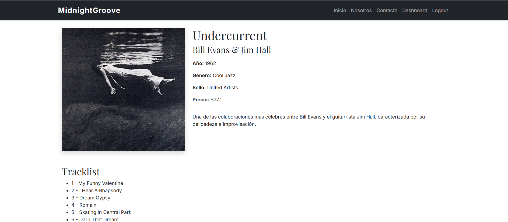
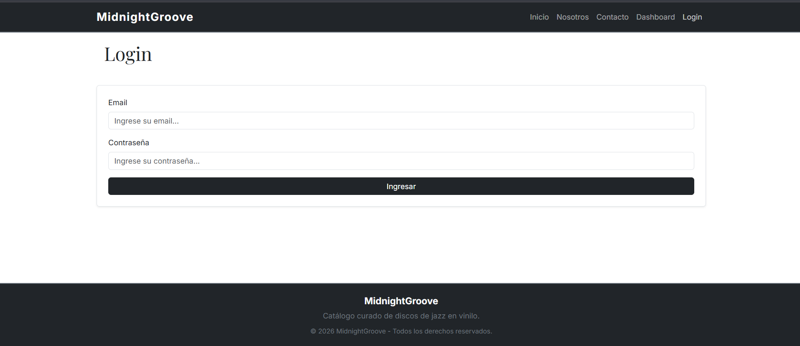

# TP Enrutamiento - MidnightGroove - Firebase

## Descripción

**MidnightGroove** es una aplicación web desarrollada con React que simula un catálogo de discos de jazz en vinilo. En este proyecto ponen en práctica conceptos de React y React Router, incluyendo navegación entre páginas, rutas dinámicas, parámetros de búsqueda, rutas protegidas y organización modular del código.

La aplicación permite navegar por el catálogo, consultar el detalle de cada disco, filtrar los resultados por género musical y acceder a un panel de administración mediante una autenticación simulada.

---

## Demo

Podés ver la aplicación funcionando en GitHub Pages:

https://f-ariel-pavoni.github.io/curso-react-js-tp7-enrutamiento/

---

## Tecnologías utilizadas

- React
- React Router DOM
- Bootstrap 5
- CSS3
- JavaScript (ES6+)
- Vite

---

## Hooks utilizados

- **useState**
  - Manejo del estado de los formularios y componentes interactivos.

- **useParams**
  - Obtención del identificador del disco desde la URL para mostrar la información detallada de cada disco.

- **useEffect**
  - Utilizado para ejecutar cargas asíncronas de datos al montar componentes, como la obtención del catálogo y el detalle de cada disco mediante servicios.

- **useSearchParams**
  - Administración del filtro por género mediante parámetros de consulta en la URL, permitiendo compartir enlaces y conservar el estado del filtro al recargar la página.

- **useNavigate**
  - Se utilizó el hook `useNavigate` para implementar la navegación programática. El botón **"Ingresar"** del componente **AccesoAdmin** redirige al usuario a la pantalla de **Login** sin necesidad de utilizar un enlace (`<Link>`).

- **useLocation**
  - Para conservar la ruta de origen al redirigir un usuario no autenticado al Login.

---

## Estructura del proyecto

```text
public/
├── data/
│   └── discos.json
└── img/
    └── ...
src/
├── components/
│   ├── AccesoAdmin/
│   ├── Catalogo/
│   ├── FiltroSelect/
│   ├── Footer/
│   ├── ModalEstado/
│   ├── Navbar/
│   ├── RutaProtegida/
│   ├── TarjetaDisco/
│   ├── Tracklist/
│   └── ...
│
├── data/
│   └── usuarios.js
│
├── layouts/
│   └── MainLayout.jsx
│
├── pages/
│   ├── Contacto/
│   ├── Dashboard/
│   ├── Disco/
│   ├── Inicio/
│   ├── Login/
│   ├── Nosotros/
│   └── NotFound/
│
├── services/
│   ├── discoService.js
│   └── usuarioService.js
│
├── App.jsx
└── main.jsx
```

---

## Criterios de diseño y arquitectura

### Arquitectura basada en componentes

La aplicación fue desarrollada utilizando componentes reutilizables, buscando mantener una clara separación de responsabilidades y facilitar el mantenimiento del código.

### Separación entre páginas y componentes

Las vistas principales fueron organizadas dentro de la carpeta **pages**, mientras que los elementos reutilizables de la interfaz se ubicaron en **components**.

### Layout compartido

Se implementó un **MainLayout** que contiene el `Navbar`, el `Footer` y un `<Outlet />` de React Router. Esta estructura evita repetir código entre páginas y permite utilizar rutas anidadas para renderizar el contenido correspondiente a cada ruta.

### Simulación de un backend

Con el objetivo de desacoplar la lógica de acceso a datos de la interfaz, se implementó una estructura de servicios que simula el comportamiento de una API REST.

Los datos del catálogo se toman de un archivo JSON ubicado en la carpeta pública del proyecto:

- `public/data/discos.json`

- **services/** centraliza el acceso a dichos datos mediante funciones reutilizables como:
  - `getDiscoById()`
  - `getGeneros()`
  - `authenticate()`

Para el caso de la autenticacion:

- `usuarios.js` que contiene los usuarios utilizados para validar el acceso.
- `usuarioService.js` que centraliza la lógica de autenticación mediante la función authenticate().

La idea de esta organización es poder reemplazar mas fácilmente los datos locales por una API REST en futuras versiones de la aplicación.

### Generación dinámica del filtro

Las opciones del filtro por género no fueron escritas manualmente. Se generan dinámicamente a partir del catálogo mediante la función `getGeneros()`, evitando duplicar información y manteniendo sincronizada la interfaz con los datos disponibles.

### Navegación

La aplicación implementa distintas funcionalidades de React Router:

- Rutas públicas.
- Rutas dinámicas mediante `useParams`.
- Parámetros de búsqueda con `useSearchParams`.
- Rutas protegidas mediante autenticación simulada. El acceso al **Dashboard** se encuentra protegido. Si un usuario intenta acceder sin haberse autenticado, es redirigido automáticamente a la pantalla de **Login** y se muestra un modal con el mensaje, conservando la ruta de origen mediante `useLocation`. Una vez que la autenticación es exitosa, la información del usuario se almacena en `localStorage`, permitiendo mantener la sesión iniciada y acceder posteriormente al Dashboard desde el menú de navegación.
- Ruta para páginas inexistentes (404). Cuando se accede a un id de disoco inexiste se muestra un not found.
- Layout compartido utilizando rutas anidadas y `<Outlet />`.

### Diseño de la interfaz

Bootstrap fue utilizado como base para construir una interfaz responsive, complementándose con estilos CSS personalizados para lograr una identidad visual inspirada en un catálogo de jazz, priorizando la simplicidad, la legibilidad y la accesibilidad.

---

## Cómo ejecutar el proyecto

Clonar el repositorio:

```bash
git clone https://github.com/f-Ariel-Pavoni/curso-react-js-tp7-enrutamiento
```

Ingresar al directorio del proyecto:

```bash
cd REPOSITORIO
```

Instalar las dependencias:

```bash
npm install
```

Ejecutar el servidor de desarrollo:

```bash
npm run dev
```

La aplicación estará disponible en:

```text
http://localhost:5173/curso-react-js-tp7-enrutamiento
```

---

## Capturas de pantalla

### Página de inicio


### Detalle de un disco



### Pantalla de login



### Dashboard protegido


### Dashboard accesible


---

## Autor

**Ariel Pavoni**

Proyecto desarrollado como trabajo práctico para la **Diplomatura Full Stack - UTN Learning**.
