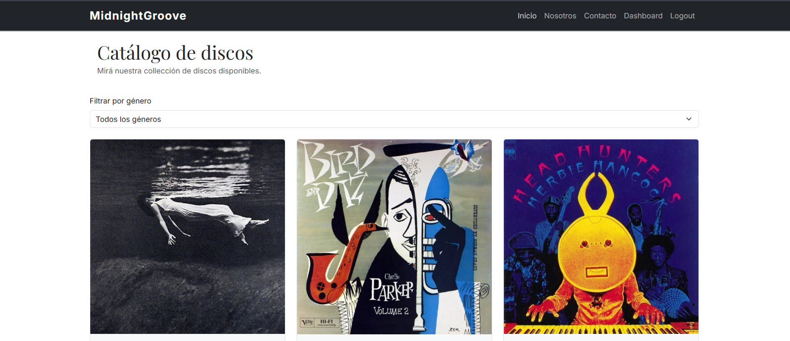
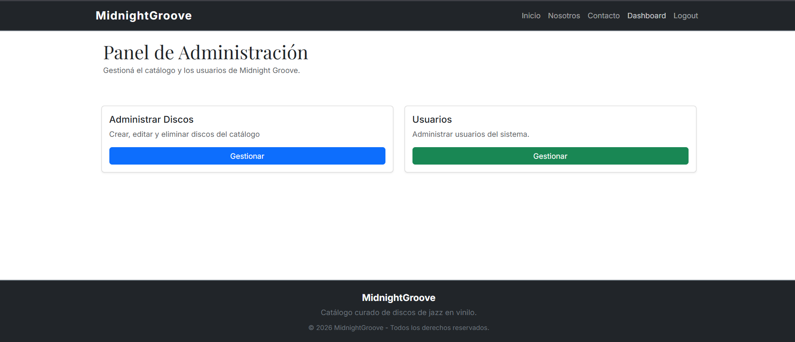
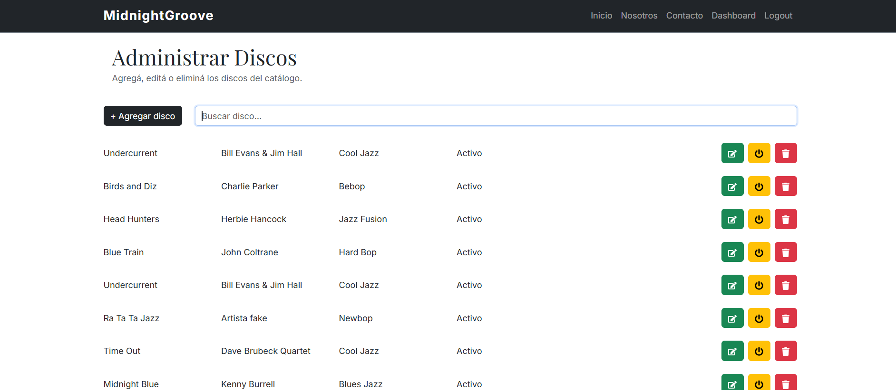

MidnightGroove

## Descripción

**MidnightGroove** es una aplicación web desarrollada con React que simula un catálogo de discos de jazz en vinilo. El proyecto integra los principales contenidos trabajados durante la cursada, incluyendo React, React Router, formularios, validación, Firebase Authentication y Cloud Firestore.

La aplicación cuenta con un catálogo público de discos y un panel administrativo desde el cual se pueden gestionar los registros almacenados en Firebase.

Los discos se almacenan en la colección `discos` de **Cloud Firestore**. Cada documento representa un álbum del catálogo e incluye información como título, artista, año, género, sello discográfico, descripción, precio, portada, tracklist y estado del registro.

La comunicación con Firestore está encapsulada dentro de la carpeta `services/`, evitando que los componentes de React tengan conocimiento directo de la implementación de la base de datos. Para esto se utilizan los métodos proporcionados por el SDK de Firebase:

- `collection()` para obtener referencias a las colecciones de Firestore.
- `getDocs()` para recuperar múltiples documentos.
- `query()` y `where()` para realizar consultas filtradas.
- `onSnapshot()` para establecer escuchas en tiempo real sobre consultas de Firestore.
- `doc()` para trabajar con documentos específicos.
- `addDoc()` para crear nuevos registros.
- `updateDoc()` para modificar información existente.
- `setDoc()` con `merge` para realizar actualizaciones parciales.
- `deleteDoc()` para eliminar documentos.

A partir de esta implementación se construyeron los servicios necesarios para gestionar el catálogo, permitiendo realizar operaciones CRUD desde el panel administrativo. Además, se implementó la modificación del estado `activo/inactivo` de los discos como operación adicional sobre un campo booleano.

El proyecto también incluye una herramienta auxiliar desarrollada con Node.js (`tools/importarDiscos.js`) que permite cargar los datos iniciales del catálogo desde un archivo JSON hacia Firestore. La herramienta contempla modos de carga completa e incremental.

Para la autenticación del panel administrativo se utiliza **Firebase Authentication**, con acceso mediante correo electrónico y contraseña a través del método `signInWithEmailAndPassword()` del SDK de Firebase.

La lógica de autenticación está separada mediante un servicio (`authService.js`) y un hook personalizado (`useAuth.js`). El servicio se encarga de comunicarse con Firebase, mientras que el hook administra el estado del usuario autenticado, errores y acciones disponibles para los componentes.

La persistencia de la sesión está configurada mediante `browserSessionPersistence`, manteniendo la autenticación durante la sesión del navegador.

El acceso al Dashboard administrativo está protegido mediante rutas privadas, verificando la existencia de un usuario autenticado antes de permitir la navegación. En caso contrario, el usuario es redirigido al Login conservando la ruta original para poder continuar luego de autenticarse correctamente.

## Configuracion de reglas en Firebase:

```javascript
rules_version = '2';
service cloud.firestore {
  match /databases/{database}/documents {
    match /discos/{documentId} {
      allow read: if true;
      allow write: if request.auth != null;
    }
    match /portadas/{documentId} {
      allow read: if true;
      allow write: if request.auth != null;
    }
    match /usuarios/{documentId} {
      allow read: if true;
      allow write: if request.auth != null;
    }
    match /audit/{documentId} {
      allow read: if request.auth != null;
      allow write: if request.auth != null;

    }
  }
}
```

---

## Demo

Podés ver la aplicación funcionando en Netlify:

[midnightGroove](https://midnightgroove.netlify.app/)


---

## Tecnologías utilizadas

- React
- Vite
- JavaScript (ES6+)
- React Router DOM
- React Hook Form
- Zod
- Firebase Authentication
- Cloud Firestore
- Bootstrap 5
- React Icons
- CSS3

---

## Hooks utilizados

- **useState**
  - Manejo del estado de los formularios y componentes interactivos.

- **useParams**
  - Obtención del identificador del disco desde la URL para mostrar la información detallada de cada disco.

- **useEffect**
  - Utilizado para ejecutar efectos secundarios relacionados con la obtención y sincronización de datos. En los hooks `useDiscos` y `useDiscosAdmin` se utiliza para establecer una suscripción mediante `onSnapshot()` al montar el componente y cancelar dicha suscripción al desmontarlo.

- **useSearchParams**
  - Administración del filtro por género mediante parámetros de consulta en la URL, permitiendo compartir enlaces y conservar el estado del filtro al recargar la página.

- **useNavigate**
  - Se utilizó el hook `useNavigate` para implementar la navegación programática. El botón **"Ingresar"** del componente **AccesoAdmin** redirige al usuario a la pantalla de **Login** sin necesidad de utilizar un enlace (`<Link>`).

- **useLocation**
  - Para conservar la ruta de origen al redirigir un usuario no autenticado al Login.

---

## Estructura del proyecto

```text
src/
├── components/      # Componentes reutilizables de interfaz
├── hooks/           # Hooks personalizados para lógica de estado y datos
├── layouts/         # Estructuras compartidas de páginas
├── pages/           # Vistas principales de la aplicación
├── schemas/         # Validaciones con Zod
├── services/        # Lógica de acceso a Firebase y operaciones CRUD
├── firebase/        # Configuración de Firebase
├── App.jsx
└── main.jsx

tools/
└── importarDiscos.js # Script para carga inicial de datos en Firestore

public/
├── img/             # Recursos estáticos
└── data/            # Datos utilizados para importación inicial
```

---

## Criterios de diseño y arquitectura

### Arquitectura basada en componentes

La aplicación fue desarrollada utilizando componentes reutilizables, buscando mantener una clara separación de responsabilidades y facilitar el mantenimiento del código.

### Separación entre páginas y componentes

Las vistas principales fueron organizadas dentro de la carpeta **pages**, mientras que los elementos reutilizables de la interfaz se ubicaron en **components**.

### Layout compartido

Se implementó un **MainLayout** que contiene el `Navbar`, el `Footer` y un `<Outlet />` de React Router. Esta estructura evita repetir código entre páginas y permite utilizar rutas anidadas para renderizar el contenido correspondiente a cada ruta.

### Integración con Firebase Firestore

La aplicación utiliza **Cloud Firestore** como base de datos para almacenar y consultar el catálogo de discos.

La lógica de acceso a datos se encuentra centralizada en la carpeta **services/**, desacoplando la interfaz de usuario de la implementación de la base de datos.

Actualmente se implementan servicios como:

- `getDiscos()`
- `getDiscoById()`
- `getGeneros()`
- `escucharDiscos()`
- `escucharDiscosAdmin()`
- authService.js para autenticación mediante Firebase Authentication
- servicios administrativos para operaciones CRUD

El archivo `public/data/discos.json` ya no es utilizado por la aplicación durante su funcionamiento. Se conserva únicamente como fuente de datos para la herramienta de importación inicial (`tools/importarDiscos.js`), que permite poblar la colección `discos` de Firestore.

### Autenticación con Firebase

La aplicación utiliza **Firebase Authentication** para gestionar el acceso al panel administrativo.

La lógica de autenticación se encuentra separada en la carpeta `services/`, desacoplando la interfaz de usuario del proveedor de autenticación.

Actualmente se implementa:

- `authService.js`
  - Centraliza las operaciones de autenticación.
  - Gestiona el inicio de sesión mediante Firebase Authentication.

- `useAuth.js`
  - Hook personalizado que encapsula la lógica de autenticación.
  - Maneja el usuario autenticado, el proceso de login y los errores asociados.

Las rutas administrativas se encuentran protegidas mediante un componente de ruta protegida, que valida la existencia de un usuario autenticado antes de permitir el acceso al Dashboard.

## Gestión del catálogo mediante CRUD

La aplicación implementa un sistema de administración del catálogo de discos utilizando las operaciones CRUD (Create, Read, Update, Delete) sobre la colección `discos` de Cloud Firestore.

La lógica de estas operaciones se encuentra separada de los componentes visuales mediante servicios y hooks personalizados, permitiendo mantener una arquitectura donde la interfaz de usuario no tiene acceso directo a la base de datos.

### Create (Crear)

La creación de nuevos discos se realiza desde el panel administrativo mediante un formulario desarrollado con **React Hook Form** y validado utilizando **Zod**.

El formulario permite ingresar la información principal del álbum:

- título
- artista
- año
- género
- sello discográfico
- descripción
- precio
- portada

Antes de enviar los datos a Firestore se aplican validaciones de formato y reglas de negocio, evitando almacenar información incompleta o inconsistente.

Una vez validado el formulario, el servicio correspondiente utiliza el método `addDoc()` del SDK de Firebase para crear un nuevo documento dentro de la colección `discos`.

### Read (Consultar)

La lectura de información se realiza mediante consultas a Cloud Firestore utilizando los métodos `getDocs()`, `query()` y `where()`.

Además, para las listas de discos se implementó `onSnapshot()`, permitiendo establecer una escucha en tiempo real sobre las consultas de Firestore. De esta manera, cuando se produce un cambio en los documentos observados, Firestore notifica automáticamente a la aplicación y el estado de React se actualiza sin necesidad de volver a realizar manualmente la consulta.

La aplicación implementa diferentes lecturas según el contexto:

- Obtención del catálogo público de discos.
- Escucha en tiempo real del catálogo público mediante `escucharDiscos()`.
- Consulta del detalle de un disco mediante su identificador.
- Obtención dinámica de géneros disponibles para los filtros.
- Carga y escucha en tiempo real de los datos del panel administrativo mediante `escucharDiscosAdmin()`.

Las funciones de escucha devuelven la función de cancelación proporcionada por `onSnapshot()`. Los hooks utilizan esta función al desmontarse para cancelar la suscripción y evitar mantener escuchas activas cuando el componente ya no está en uso.

La información recuperada desde Firestore es gestionada mediante hooks personalizados, separando la lógica de acceso a datos, estados de espera, errores y suscripciones de los componentes de presentación.

### Update (Actualizar)

La modificación de registros se realiza desde el panel administrativo mediante operaciones de actualización sobre documentos existentes de Firestore.

Para identificar cada documento se utiliza su referencia mediante `doc()`, y luego se aplican modificaciones utilizando `updateDoc()`.

Actualmente se contempla la actualización del estado del disco mediante el campo `activo`, permitiendo administrar la disponibilidad del registro dentro del catálogo.

Esta implementación permite realizar una eliminación lógica del contenido, manteniendo la información almacenada y evitando perder datos históricos.

### Delete (Eliminar)

La eliminación de registros utiliza el método `deleteDoc()` de Firebase cuando se requiere eliminar físicamente un documento de Firestore.

Además, la aplicación utiliza el campo booleano `activo` como mecanismo de control de disponibilidad, permitiendo ocultar discos del catálogo sin eliminar inmediatamente la información almacenada.

Esta combinación permite diferenciar entre eliminación física y desactivación lógica, brindando mayor flexibilidad en la administración del catálogo.

### Actualización de precio

Se implementó la actualización independiente del precio de un disco utilizando `setDoc` con la opción `merge`.

La actualización se realiza mediante:

- `actualizarPrecioConMerge()` en `adminServices.js`.
- `actualizarPrecio()` en `useDiscosAdmin.js`.
- `editarPrecio()` y `confirmarPrecio()` en `AdministrarDiscos`.
- `EditorPrecio` como componente encargado de la edición del precio.

Al utilizar:

```js
await setDoc(discoRef, { precio }, { merge: true });
```

## Usuarios

Se implementó el alta de usuarios utilizando **Firebase Authentication** y **Cloud Firestore**.

El usuario se crea mediante `createUserWithEmailAndPassword()` y luego se almacena su información adicional en la colección `usuarios` de Firestore.

Para guardar el documento se utiliza `setDoc()` utilizando el `uid` generado por Firebase Authentication como ID del documento:

```js
const { uid } = userCredential.user;

const usuarioRef = doc(db, "usuarios", uid);

await setDoc(usuarioRef, {
  nombre,
  apellido,
  email,
  rol,
  activo: true,
});
```

---

### Servicios y hooks relacionados

La gestión del CRUD se encuentra organizada mediante:

- `discoService.js`
  - Operaciones de consulta del catálogo público.
  - Obtención de discos y detalles.
  - Escucha en tiempo real del catálogo mediante `escucharDiscos()`.

- `adminServices.js`
  - Operaciones administrativas sobre Firestore.
  - Creación, actualización, desactivación y eliminación de discos.
  - Actualización independiente del precio.
  - Escucha en tiempo real de los discos mediante `escucharDiscosAdmin()`.

- `useDiscosAdmin.js`
  - Hook personalizado que centraliza la lógica del panel administrativo.
  - Maneja el estado de los discos, loading, errores y acciones CRUD.
  - Mantiene sincronizada la lista administrativa mediante la suscripción a Firestore.

- `useDiscos.js`
  - Hook personalizado para gestionar el catálogo público.
  - Mantiene sincronizada la lista de discos mediante una suscripción a Firestore.

## Tools

El proyecto incluye herramientas auxiliares para administrar la carga inicial de datos en Firestore.

### Importación de discos

La herramienta `tools/importarDiscos.js` permite cargar los datos del catálogo desde el archivo:

```text
public/data/discos.json
```

Los datos son procesados mediante Node.js y enviados a la colección `discos` de Firestore.

### Carga inicial completa

Para eliminar la colección existente y volver a cargar todos los discos:

```bash
node tools/importarDiscos.js --reset
```

Este modo:

1. Elimina todos los documentos existentes de la colección `discos`.
2. Lee nuevamente el archivo `discos.json`.
3. Inserta todos los registros desde cero.

### Carga incremental

Sin argumentos, la herramienta verifica los discos existentes antes de insertar nuevos registros:

```bash
node tools/importarDiscos.js
```

Este modo:

1. Obtiene los documentos actuales de Firestore.
2. Compara los IDs existentes con los datos del JSON.
3. Solo agrega los discos que aún no existen en la colección.

### Ubicación

```text
tools/
└── importarDiscos.js
```

> **Nota:** Para ejecutar esta herramienta es necesario tener configuradas las variables de entorno de Firebase en el archivo `.env`.

### Generación dinámica del filtro

Las opciones del filtro por género no fueron escritas manualmente. Se generan dinámicamente a partir del catálogo mediante la función `getGeneros()`, evitando duplicar información y manteniendo sincronizada la interfaz con los datos disponibles.

### Navegación

La aplicación implementa distintas funcionalidades de React Router:

- Rutas públicas.
- Rutas dinámicas mediante `useParams`.
- Parámetros de búsqueda con `useSearchParams`.
- Rutas protegidas mediante Firebase Authentication. El acceso al **Dashboard** se encuentra protegido. Si un usuario intenta acceder sin haberse autenticado, es redirigido automáticamente a la pantalla de **Login** y se muestra un modal con el mensaje, conservando la ruta de origen mediante `useLocation`.
- Ruta para páginas inexistentes (404). Cuando se accede a un id de disco inexiste se muestra un not found.
- Layout compartido utilizando rutas anidadas y `<Outlet />`.

## Rutas principales

| Ruta         | Descripción                  |
| ------------ | ---------------------------- |
| `/`          | Página principal             |
| `/nosotros`  | Información del proyecto     |
| `/contacto`  | Formulario de contacto       |
| `/disco/:id` | Detalle dinámico de un disco |
| `/login`     | Acceso administrativo        |
| `/dashboard` | Panel protegido              |

### Diseño de la interfaz

Bootstrap fue utilizado como base para construir una interfaz responsive, complementándose con estilos CSS personalizados para lograr una identidad visual inspirada en un catálogo de jazz, priorizando la simplicidad, la legibilidad y la accesibilidad.

---

## Cómo ejecutar el proyecto

Clonar el repositorio:

```bash
git clone (https://github.com/f-Ariel-Pavoni/midnightGroove_firbase)
```

Ingresar al directorio del proyecto:

```bash
cd REPOSITORIO
```

Instalar las dependencias:

```bash
npm install
```

Ejecutar el servidor de desarrollo:

```bash
npm run dev
```

La aplicación estará disponible en:

```text
http://localhost:5173/
```

---

## Capturas de pantalla

### Página de inicio



### Detalle de un disco


### Pantalla de login


### Dashboard protegido



### Dashboard accesible



---

## Autor

**Ariel Pavoni**

Proyecto desarrollado como trabajo práctico para la **Diplomatura Full Stack - UTN Learning**.

---

## Bibliografia:

- React Hook Form: https://react-hook-form.com/
- Zod: https://zod.dev/
- Firebase: https://firebase.google.com/docs?hl=es-419
- Firebase para tema persistencia de sesion: https://firebase.google.com/docs/auth/web/auth-state-persistence?utm_source=chatgpt.com&hl=es-419
